# Finetuning Llama3 on the ARC Prize


The [ARC Prize](https://arcprize.org/) has recently started a Kaggle competition. Previously the contest was dominated by "DSL" algorithms, but this time around it seems like LLMs might take the cake.

On public eval, Claude 3.5 and GPT-4o already achieve results of 21% and 9% respectively at a Baseline.

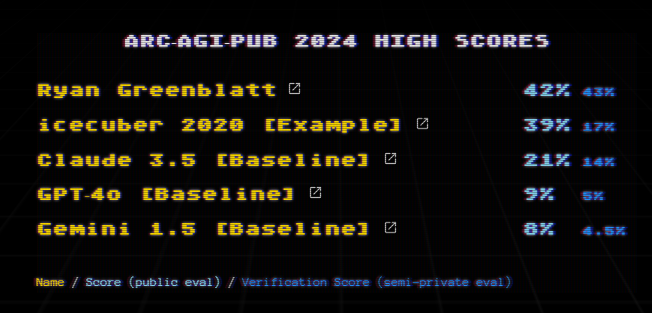

> (22.07.24 - https://arcprize.org/leaderboard)


So it seems prudent to check how far simple LLM approaches can go. 
We will try to do this *cheaply* and *quickly*, which is why we will finetune Llama3-8B using a LoRA, achieving **12.75%** accuracy on the public eval task, *beating GPT-4o* using less than $10 in compute cost.

#### Hardware

Finetuning LLMs, even with LoRA adapters, can have substantial hardware requirements, often needing at least 20GB of VRAM. While this is a lot for consumer hardware, renting GPUs is cheap, so we can test our approach using a A10 GPU and a A100 GPU on the [Lambda GPU cloud](https://lambdalabs.com/service/gpu-cloud)

The whole training and inference pipeline runs for ~6h on A10 and ~3.5h on A100 costing around $6 and $7.50 respectively.


## The Data


ARC Problems have a visual format, which introduces additional complexity for Language Models, as they cannot easily reason over 2D data. To mitigate this we create additional ARC problems:

For each challenge we create 7 additional challenges, corresponding to rotation and transposition+rotation of the original problem. 

I.e. if this is a valid challenge:
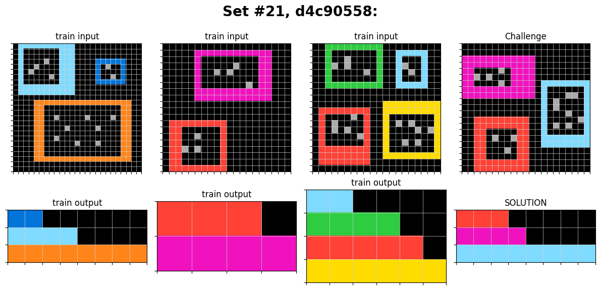
Then so is this:
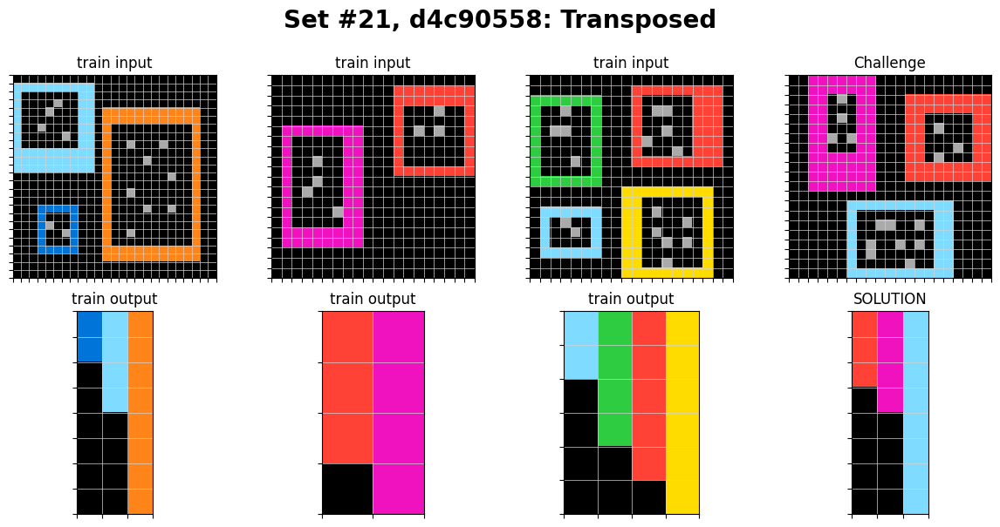

This not only helps the models to learn patterns in vertical directions, but also increases our training data size eight-fold!

---

We convert each of these problems into a simple text format, making sure that there are no tokenization problems. This is done by representing the matrix as a string and adding linebreaks for each new row. We additionally specify if a given matrix is an input or an output, and clearly mark the beginning and end of each example.

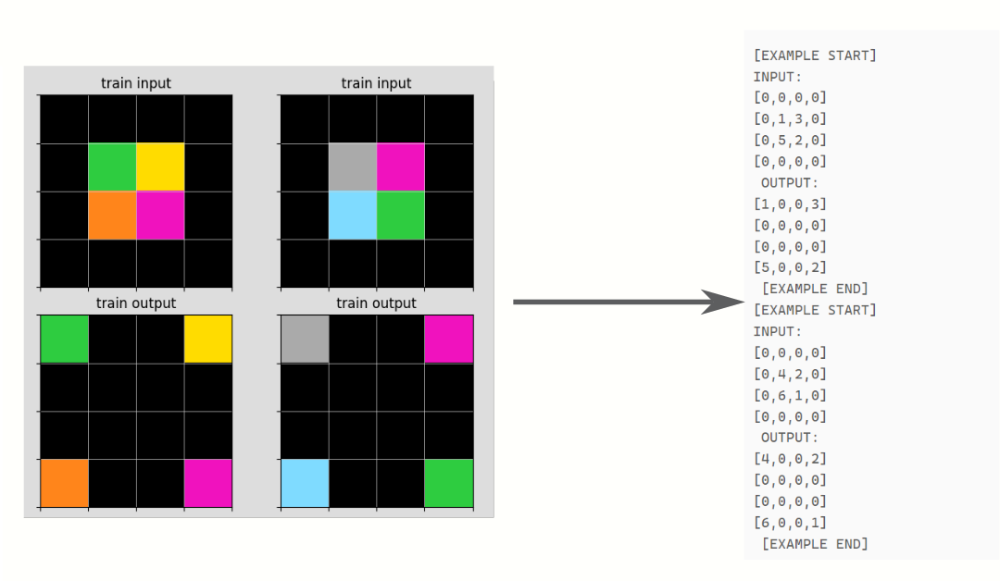

## Training

We want to train our model on the input-output examples for each Problem. We aim for 3 epochs of training, as we want the model
to learn the patterns in the data, but not to overfit.
In order to do so, we opt to use the unsloth library, which claims fast training for LoRA adapters.


#### Setup

Create and activate a virtual environment:
```bash
python -m venv --system-site-packages .unsloth
source .unsloth/bin/activate
```

Update torch and triton:
```bash
pip install --upgrade torch==2.2.0 triton --index-url https://download.pytorch.org/whl/cu121
```

Install unsloth:
```bash
pip install "unsloth[cu121-torch220] @ git+https://github.com/unslothai/unsloth.git"
```

and we are ready to go.


#### LoRA Adapter

Using a LoRA adapter is simple, we load the model and then create an adapter using the `get_peft_model` function.

```python
#create PEFT LoRA model
model = FastLanguageModel.get_peft_model(
	model,
	r = 16, #Rank of the LoRA weights
	target_modules = ["q_proj", "k_proj", 
					"v_proj", "o_proj",
					"gate_proj", "up_proj", "down_proj",
					"embed_tokens", "lm_head",], #which modules we want to target
	lora_alpha = 16,
	lora_dropout = 0, # Supports any, but = 0 is optimized
	bias = "none",    # Supports any, but = "none" is optimized
	use_gradient_checkpointing = "unsloth", 
	random_state = 1212,
	use_rslora = True,  # Rank stabilized Lora
	loftq_config = None, 
)
```

using this adapter, and our prepared data, we only need to specify some training parameters and we can start training.


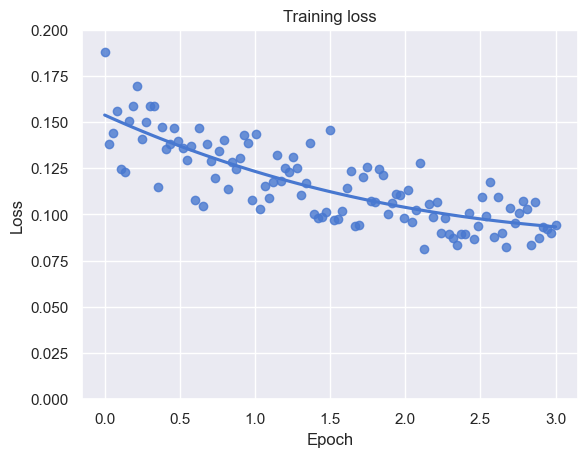

#### Prediction

The ARC contest allows up to two predictions for each challenge. As noted before, LLMs do not reason well over 2D, as they use the 1D text representation. For this reason, we create our two guesses by predicting the normal challenge and the transposed challenge. Adding the transposed challenge should help to solve problems that require a lot of vertical reasoning. 

We generate results for these tasks, and simply ignore predictions with parsing errors. We use top-k inference with $k=50$. The idea here is that this will prevent some mistakes which greedy sampling could easily run into. In the end, we produce valid guesses for 339 of the 400 challenges.
In these 339 guesses there are 51 correctly solved Problems! This corresponds to a score of **12.75%**


| Num Problems | Predictions | Solved by any Guess | Solved by first Guess | Solved by transposed Guess |
| ------------ | ----------- | ------------------- | --------------------- | ---------------------- |
| 400          | 339         | 51                  | 38                    | 28                     |

Our finetuned Llama3 models with some data augmentation beats the GPT-4o Baseline on the public eval dataset.

### Correct Prediction Examples

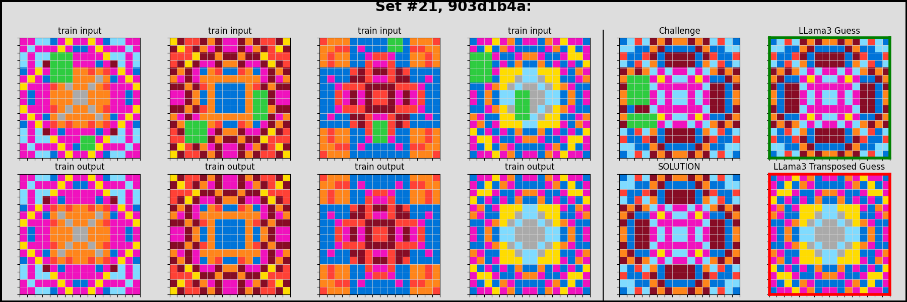
> *"Restore the symmetric pattern"*
>   This result was surprising. The action needed is not complex, but learning that action seems unlikely. The transposed prediction repeated a previous output.

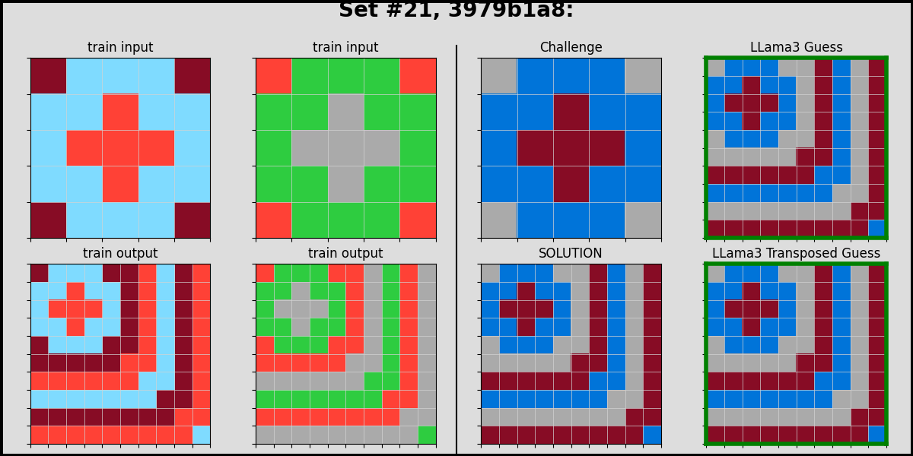
> *"Extend the pattern, repeating the colors"*
>   This is probably very easy, as the LLM can simply use a train output and remap the colors.

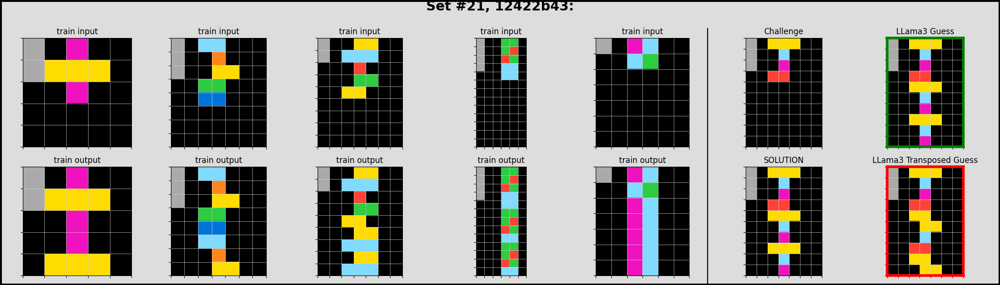
> *"Repeat the lines marked with grey"*

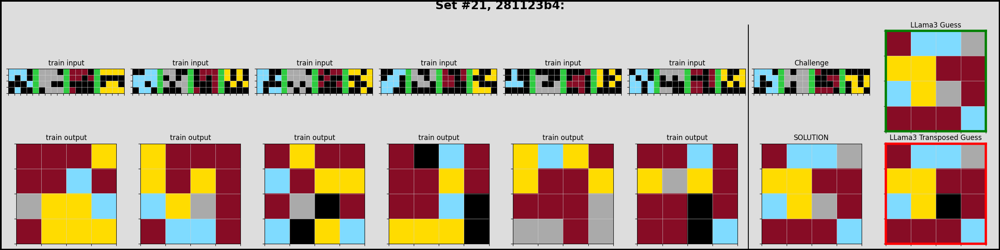
> This is an overlay task, Brown>Yellow>Blue>Grey. 

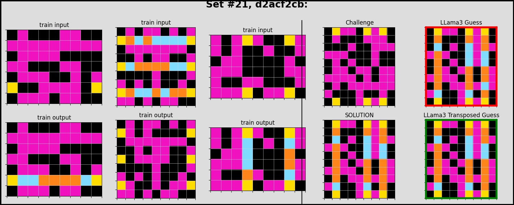
> *"Draw a line between yellow points, permuting colors of cells between them" *
>  Here we see that the transposed version has an easier time, as it has to draw lines from left to right instead of up to down.

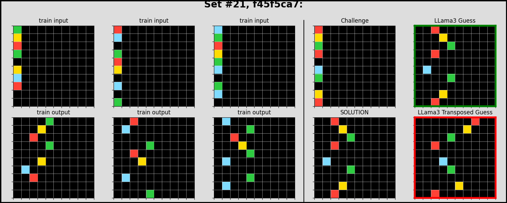
> *"Shift the pixels based on color"*
>  This is probably rather easy to learn for the LLM. The transposed version struggles, as it has to do the same task but from top to bottom instead of left to right

---


##### Common Failures of Llama and Conclusion

The Llama models often chose to repeat the last train output, instead of predicting a new guess. This might be caused by overfitting during training and can perhaps be mitigated by shuffling the input-output examples between epochs. Another issue was that Llama could not predict challenges that had a big input and output size, quickly running into token limits.

Even so, the model achieves an impressive accuracy and only rarely produces solutions that are formatted incorrectly. The problems it can solve are not simple, and in the challenges it cannot solve, we have several near misses. It seems to work particularly well when the solution has repeating patterns or uses bit-wise operations of the input.


## Training time and costs

|                    | A10               | A100              | H100             |
| ------------------ | ----------------- | ----------------- | ---------------- |
| Training Time      | 21207s (5h53m27s) | 12422s (3h27m02s) | 8243s (2h17m23s) |
| Inference Time     | 7371s  (2h02m51s) | 8550s (2h22m30s)  | 7688s (2h08m08s) |
| Hourly Cost        | $0.75             | $1.29             | $2.49            |
| Training only Cost | $4.42             | $4.45             | $5.70            |
| Final Cost         | $5.95             | $7.50             | $11.02           |


#### Appendix: Some Interesting Errors

Errors can be divided into 4 categories
1. No solution generated/Generation could not be parsed
2. Repetition of known seen training output
3. Misunderstanding of the problem
4. Near misses

Here we show some interesting cherry picked examples of the latter two categories:

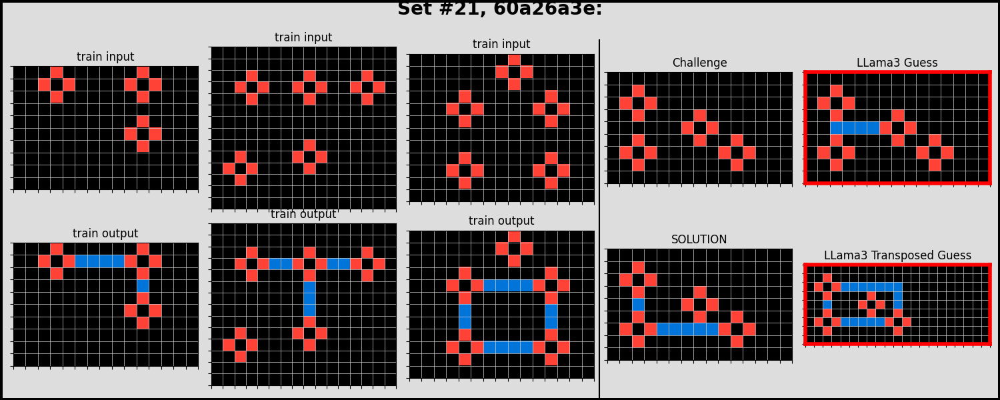
>Slight misunderstanding of task


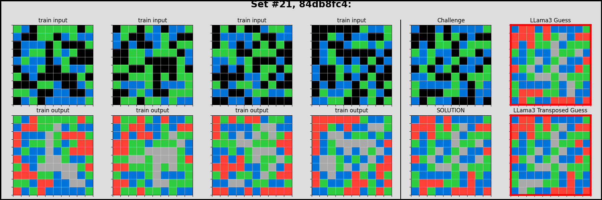
> *Almost* correct prediction

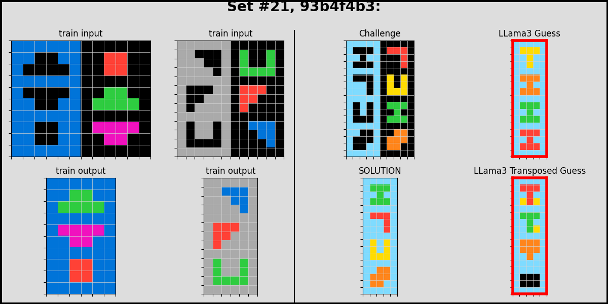
> Failure to fit shapes, probably not understanding task


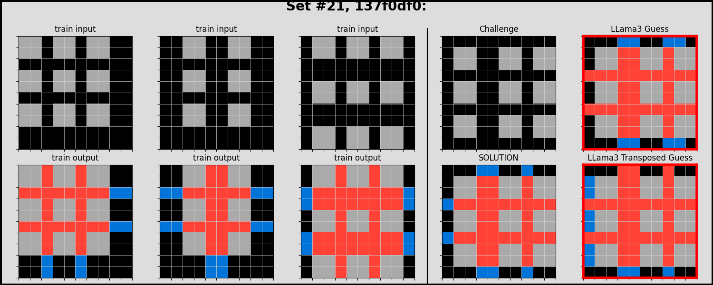
> Understands that inside of grey shape should be filled with red, does *almost* manage to add blue outside, but not quite

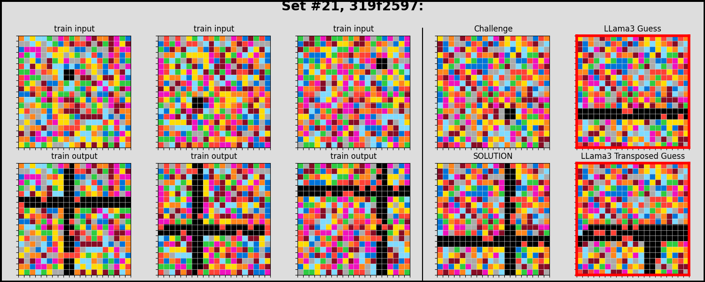
> The non-transposed version manages to correctly draw the horizontal line, the vertical line does not work at all

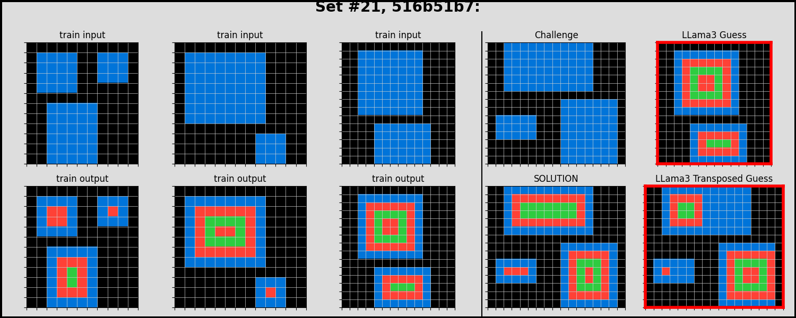
> Here the non-transposed prediction repeats a previous output. The transposed prediction almost understands the task, but fails to apply it completely


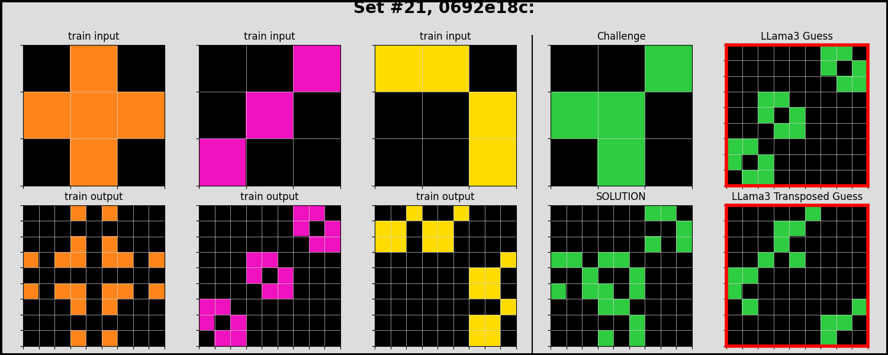
> Complete misunderstanding of task, but color is predicted correctly.


